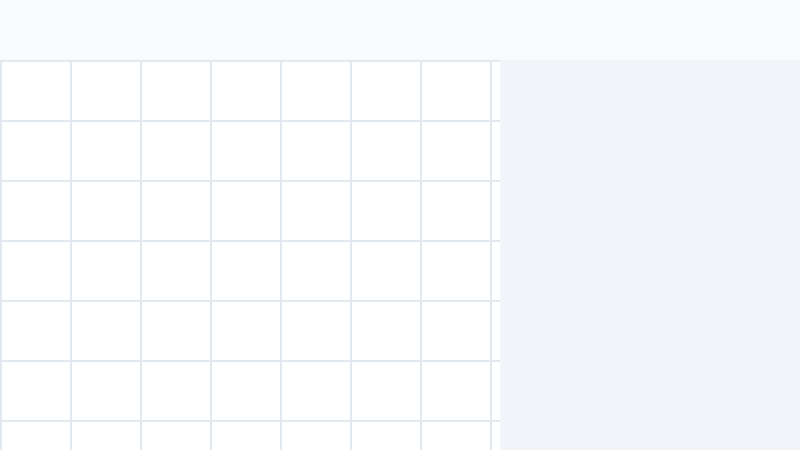

# dsh-smart-reminder

Universal Smart Reminder, Lunar Calendar & To-Do Checklist Assistant for DSH Web GUI.

[中文文档](./README.md) | [Documentación en Español](./README.es.md)

## Features

1. **Pixel-Perfect Sidebar Entry**: Seamlessly integrated below the Message Gateway tab with matching monochrome linear iconography.
2. **Trilingual i18n (EN / ZH / ES)**:
   - Full support for **English (en)**, **Chinese (zh)**, and **Spanish (es)**.
   - Locale-aware holiday system: Chinese mode displays traditional lunar calendar and festivals; International modes display global and western public holidays (Christmas, New Year, Halloween, etc.).
3. **Interactive To-Do Checklist**:
   - Round checkboxes with instant strikethrough completion.
   - Filter pills for `All`, `Pending`, and `Completed` items.
   - Real-time keyword search for titles and notes.
4. **Visual Date & Time Picker**:
   - Native date/time picker inputs.
   - Quick-select time pills (`09:00`, `11:30`, `14:00`, `16:30`, `18:00`, `20:00`).
   - Priority coding: 🔴 High (Urgent), 🟡 Medium, 🟢 Low.
5. **One-Click Snooze & 5-Second Undo**:
   - Postpone active reminders by `+15m` or `+1h` with one click.
   - Instant 5-second Undo toast when deleting items to prevent accidental loss.
6. **Offline Catch-Up Banner**:
   - Automatically detects missed reminders after system sleep or restart and displays an alert banner.
7. **iCal (.ics) Calendar Export**:
   - One-click export to standard `.ics` calendar files ready to import into Apple Calendar, Google Calendar, and Microsoft Outlook.
8. **Cross-Platform Native Notifications**:
   - **macOS**: Native notifications with official Apple Reminders / Calendar icons.
   - **Windows**: Native Windows 10/11 Toast Notifications.
   - **Multi-channel**: Automatically integrates with active messaging platforms (WeCom / Telegram / Discord / Email) when configured.
9. **Keyboard Shortcuts**:
   - `Esc`: Close modal/panel.
   - `Cmd + K` / `Ctrl + K`: Quick create reminder.
   - `← / →`: Previous / Next month.

## Agent Tool Reference

- `set_reminder(title, dueTime, description?, repeat?, pushPlatform?, pushTarget?)`: Schedule reminders.
- `list_reminders(type?: "upcoming" | "history" | "all")`: Query reminders.
- `complete_reminder(id)`: Mark reminder as completed or reopen.
- `snooze_reminder(id, minutes?)`: Postpone reminder.
- `cancel_reminder(id)`: Delete/cancel reminder.

## Feedback & Issues

💡 **We warmly welcome your issues and suggestions!**  
If you encounter any bugs, have feature requests, or want to contribute improvements, please feel free to [open an Issue on GitHub](https://github.com/a792883583/dsh-smart-reminder/issues).  
*(Note: Please follow our issue templates so our automation bot can process your request smoothly!)*

## License

MIT
