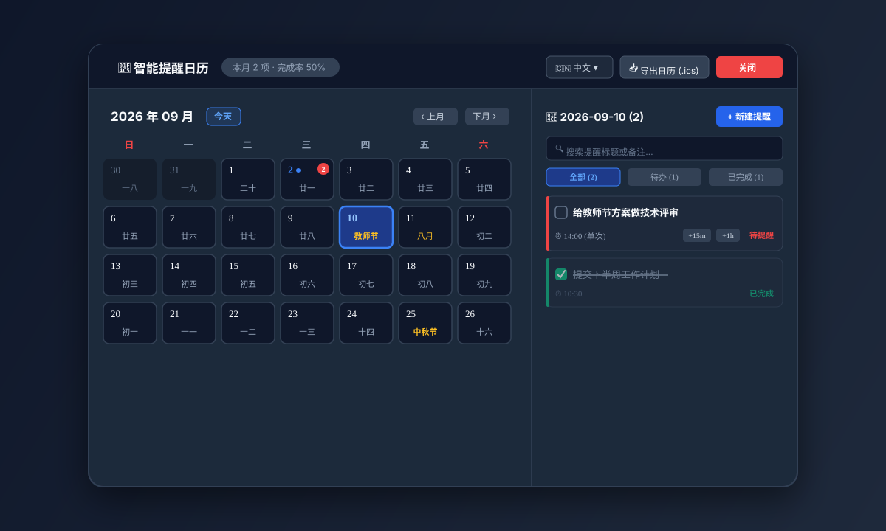
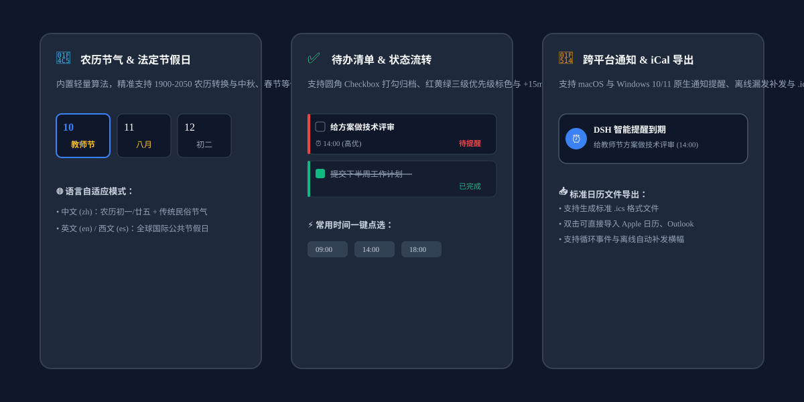

# dsh-smart-reminder: Smart Calendar Reminder & Schedule Assistant

Universal calendar reminder, lunar calendar dashboard, and to-do checklist plugin for DSH Web GUI.

[Documentación en Español](./README.es.md) | [中文说明文档](./README.md)

## UI Preview

### 1. Fullscreen Calendar Dashboard & To-Do Workflow

### 2. Feature Architecture

---

## Key Features

1. **Seamless Sidebar Navigation**: Embedded right below "Message Gateway" with an official monochrome outline icon.
2. **Native Desktop Banners**:
   - 🔔 Deeply integrated with macOS native notification center banners paired with the crisp 'Glass' chime.
   - 🪟 Full Windows 10/11 Toast Notification support (`scenario="reminder"` + `Priority=High`), providing instant popup banners and sound alerts even when Focus Assist (Priority Only) is active.
3. **Drag & Drop Rescheduling**:
   - 🖱️ Directly click and drag any reminder card from the right list and drop it onto any calendar date cell to reschedule instantly!
4. **In-Place Reminder Editing**:
   - ✏️ Click the edit button on any reminder card to modify title, time, repeat rules, push platforms, and notes with one click.
5. **Native DSH Web Locale Sync**:
   - Automatically and reactively follows DSH Web language settings (English, Spanish, Chinese) across all titles, buttons, tips, and date formats.
6. **Interactive Checklist & Status Filtering**:
   - Checkbox completion with animated strikethrough.
   - Quick status capsules (`All` / `Pending` / `Completed`) and instant search query filter.
7. **Message Gateway Ecosystem Integration**:
   - Seamlessly detects and links with [`dsh-message-gateway`](https://www.npmjs.com/package/dsh-message-gateway) to push notifications to **WeCom AI Bot**, **Telegram**, **Discord**, or **Email**.
   - 🔴 High (Urgent) / 🟡 Medium / 🟢 Low priority color indicators.
8. **One-Click Snooze & 5-Second Undo**:
   - Postpone tasks by `+15m` or `+1h` with one tap.
   - Deletion includes a 5-second Undo toast to prevent accidental actions.
9. **Offline Missed Reminder Catch-up**:
   - Detects due tasks that occurred while offline or asleep and presents a catch-up banner.
10. **RFC 5545 iCal (.ics) Calendar Export**:
    - Export standard `.ics` calendar files directly compatible with Apple Calendar, Google Calendar, and Outlook.
11. **Full Keyboard Navigation**:
    - `Esc`: Close modal or overlay;
    - `Cmd/Ctrl + K`: Quickly open new reminder dialog;
    - `← / →`: Switch between months.

## Agent Tools

- `set_reminder(title, dueTime, description?, repeat?, pushPlatform?, pushTarget?)`: Schedule reminders.
- `list_reminders(type?: "upcoming" | "history" | "all")`: Query reminders.
- `complete_reminder(id)`: Mark tasks as completed or revert them.
- `snooze_reminder(id, minutes?)`: Postpone reminders.
- `cancel_reminder(id)`: Cancel and remove reminders.

## License

MIT
